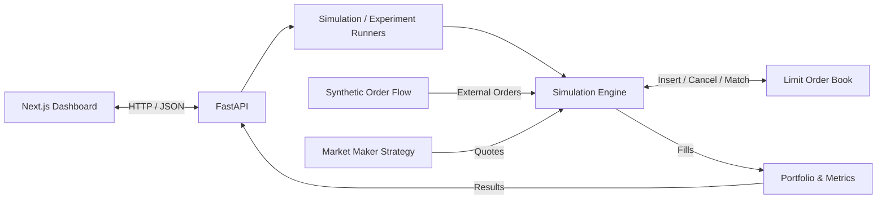

# MarketSim

An interactive full-stack market-making and limit-order-book simulator for comparing trading strategies under reproducible synthetic market conditions.

**Python · FastAPI · Next.js · TypeScript · React**

## Overview

MarketSim combines a Python simulation engine with an interactive dashboard for exploring order matching, market-making strategies, inventory risk, and portfolio performance.

The simulator implements a price-time-priority limit order book, synthetic order flow, portfolio accounting, and two market-making strategies. Experiments can be reproduced with fixed random seeds and extended across multiple seeds, parameter sweeps, and changing market regimes.

Orders are entirely synthetic. MarketSim does not connect to a brokerage or execute real trades.

## Features

- **Limit order book** with price-time priority, partial fills, cancellation, and resting-order execution prices
- **Two market-making strategies:** fixed-spread and inventory-aware quoting
- **Reproducible simulations** using deterministic seeded order flow
- **Strategy comparisons** under identical external market conditions
- **Multi-seed experiments** for comparing behavior across different market paths
- **Parameter sweeps** across volatility, buy pressure, activity, spread, and inventory risk
- **Scenario stress testing** across changing market regimes
- **Interactive analytics** for P&L, inventory exposure, fills, prices, and execution metrics
- **59 backend tests** covering matching, accounting, reproducibility, paired experiment consistency, and validation


## Dashboard

MarketSim provides five simulation and experiment workflows:

| Workflow | Purpose |
| --- | --- |
| Single Strategy | Inspect Basic or Inventory-Aware on one seeded market path |
| Strategy Comparison | Compare both strategies under identical market conditions |
| Multi-Seed Experiment | Compare strategy behavior across consecutive seeds |
| Parameter Sweep | Measure how results change as one parameter varies |
| Scenario Stress Test | Test strategies across changing market regimes |

The dashboard exposes simulation parameters directly and displays results through synchronized charts, summary metrics, and detailed analytics.

## How the Simulation Works

Each simulation starts with an empty order book, a market maker with zero inventory, and $100,000 in starting cash.

For each tick:

1. The market maker observes the current book and refreshes its bid and ask quotes.
2. Quotes enter the limit order book and match immediately if they cross existing orders.
3. Synthetic external orders arrive according to the configured market conditions.
4. Trades update the market maker's cash and inventory.
5. Portfolio value and P&L are marked using the external reference price.

Orders are matched using **price priority followed by FIFO priority** at equal prices. Trades execute at the resting order's price, and partial fills retain their original priority.

Synthetic order flow determines the reference price, order side, limit price, and quantity. A fixed random seed reproduces the same external market path.

### Valuation

MarketSim separates the order book's midprice from the external reference price used to value inventory.

```text
portfolio value = cash + inventory × mark price
P&L = portfolio value - starting cash
```

Paired strategies use the same external mark price, allowing their portfolios to be compared independently of their own quotes.

## Market-Making Strategies

### Basic Market Maker

The Basic strategy places a fixed spread around the observed book midprice:

```text
bid = midprice - spread / 2
ask = midprice + spread / 2
```

It does not adjust its quotes in response to accumulated inventory.

### Inventory-Aware Market Maker

The Inventory-Aware strategy shifts its reservation price according to its current position:

```text
reservation price = midprice - inventory × inventory risk factor

bid = reservation price - spread / 2
ask = reservation price + spread / 2
```

A long position shifts quotes downward, while a short position shifts them upward. This allows the strategy to respond to inventory accumulation rather than always quoting symmetrically around the midprice.

Both strategies round quotes outward to the simulator's one-cent price tick.

## Simulation Parameters

| Parameter | Description |
| --- | --- |
| Starting Price | Initial external reference price |
| Random Seed | Controls reproducible synthetic order flow |
| Ticks | Number of simulation steps |
| Volatility | Maximum reference-price movement per external arrival |
| Buy Pressure | Probability that an external order is a buy |
| Market Activity | Number of external arrivals per tick |
| Spread | Target distance between maker bid and ask |
| Order Size | Quantity placed in each maker quote |
| Inventory Risk Factor | Strength of the inventory adjustment |

## Experiments

### Strategy Comparison

Basic and Inventory-Aware can be run with the same random seed and market parameters while maintaining independent books and portfolios.

This allows P&L, inventory exposure, fills, and execution behavior to be compared under the same external order flow.


### Multi-Seed Experiments

A single simulation can vary with its random market path. Multi-seed experiments repeat paired strategy comparisons across consecutive seeds and aggregate P&L, inventory exposure, fills, and executed volume.

Each strategy receives the same external order flow for a given seed, keeping the comparison controlled while allowing their books and executions to diverge.

### Parameter Sweeps

Parameter sweeps repeat paired experiments while changing one parameter:

- Volatility
- Buy pressure
- Market activity
- Spread
- Inventory risk factor

The same seed sequence is reused at each parameter value so changes can be compared under controlled synthetic conditions.


### Scenario Stress Testing

Scenario tests run a continuous simulation through **normal, stressed, and recovery regimes**.

Built-in scenarios include:

- Volatility Shock
- Buy-Side Pressure
- Sell-Side Pressure
- Liquidity Surge

The simulation state, order book, portfolio, reference price, and random number generator continue across regime transitions rather than restarting.


## Correctness and Testing

The backend includes **59 passing tests** covering the core simulation and experiment logic, including:

- Order matching, FIFO priority, partial fills, cancellation, and resting-order pricing
- Portfolio accounting, inventory tracking, and market-maker fills
- Seeded reproducibility and paired strategy market paths
- Multi-seed experiments, parameter sweeps, scenarios, and input validation

Run the backend test suite:

```powershell
cd backend
.\.venv\Scripts\python.exe -m unittest discover -s tests -t . -v
```

Frontend checks:

```powershell
cd frontend
npm run lint
npx tsc --noEmit
npm run build
```

## Architecture



Python handles order matching, strategies, portfolio accounting, simulations, and experiments behind FastAPI. The Next.js frontend handles configuration, API requests, and interactive visualization.

## Tech Stack

| Area | Technologies |
| --- | --- |
| Frontend | Next.js 16, React 19, TypeScript, Tailwind CSS 4, Recharts |
| Backend | Python 3.12, FastAPI, Pydantic 2, Uvicorn |
| Testing & Tooling | Python `unittest`, FastAPI `TestClient`, ESLint, TypeScript compiler, Git |

## Getting Started

### Backend

From the repository root:

```powershell
cd backend

python -m venv .venv
.\.venv\Scripts\Activate.ps1

python -m pip install -r requirements.txt
python -m uvicorn app.main:app --reload
```

The API runs at `http://localhost:8000`.

### Frontend

Open a second terminal:

```powershell
cd frontend

npm ci
npm run dev
```

Open `http://localhost:3000`.

No API keys or external services are required.

## Model Assumptions and Limitations

MarketSim is an educational simulation rather than a production exchange or trading system.

- Order flow is synthetic and is not calibrated to historical market data.
- Reference prices follow a discrete random walk.
- External arrivals occur at a fixed number per tick.
- External resting orders can remain in the book indefinitely.
- Market-maker quotes refresh once per simulation tick.
- Inventory exposure is sampled at tick end.
- Accounting uses floating-point arithmetic.
- The model does not include transaction fees, latency, capital constraints, or position limits.
- Simulation results should not be interpreted as expected real-world trading performance.